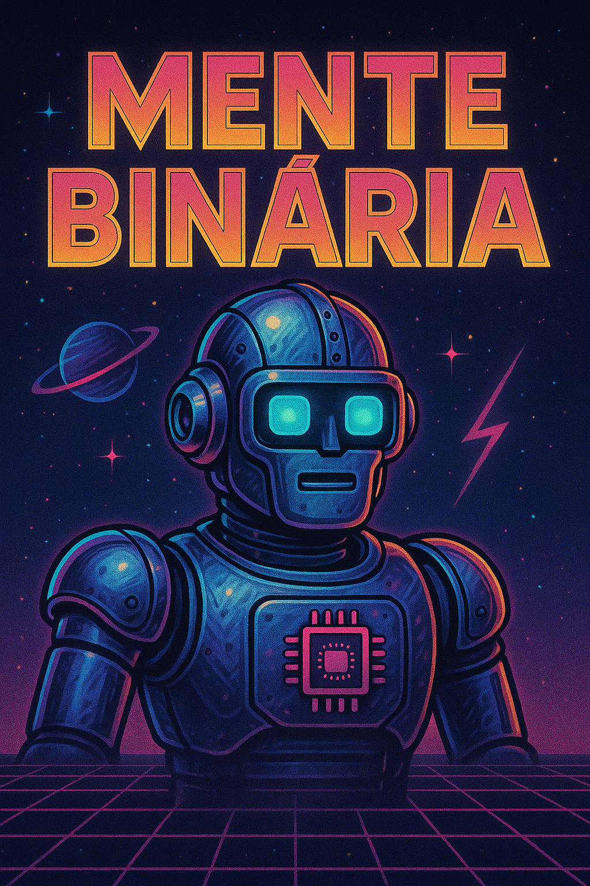

    Preview do Podcast

    <audio src="audio/Inteligência Artificial ou Espertice Artificial.mp3" controls title="Podcast editado"></audio>

 

# Projeto Podcast Gerado por I.A.s

Projeto com o objetivo de gerar um podcast utilizando ferramentas de IA através de prompts mais trabalhado.

## 💻 Tecnologias utilizadas no projeto

- [ChatGPT](https://chat.openai.com/) 
- [ElevenLabs](https://beta.elevenlabs.io/)
- [Capcut](https://www.capcut.com/pt-br/)

## ✨ Como foi feito ?

- Roteiro gerado via chatgpt
- Audio gerado pela elevenLabs
- ChatGPT Para gerar capas
- Capcut para tratar aúdio e adicionar sons de fundo